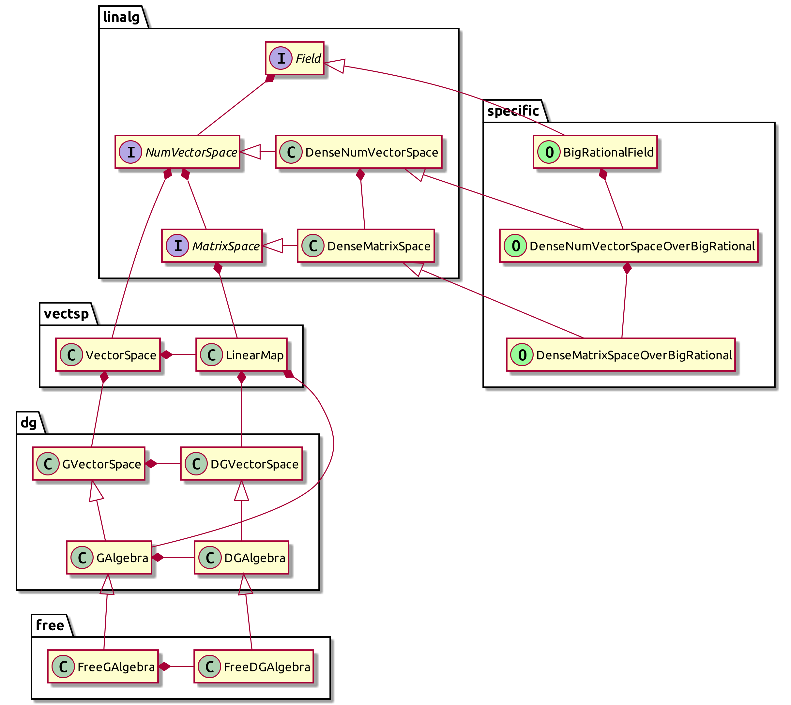

[](https://shwaka.github.io/maven/com/github/shwaka/kohomology/)
[](https://github.com/shwaka/kohomology/actions/workflows/gradle.yml)
[](https://codecov.io/gh/shwaka/kohomology)
[](https://github.com/shwaka/kohomology/blob/main/LICENSE)

`kohomology` is a [Kotlin](https://kotlinlang.org/) library to compute the cohomology of a cochain complex. The main target is a Sullivan algebra (in [Rational homotopy theory - Wikipedia](https://en.wikipedia.org/wiki/Rational_homotopy_theory)).

- This library is a [kotlin multiplatform](https://kotlinlang.org/docs/multiplatform.html) project. So it can be compiled for JVM and browser. (See [shwaka/kohomology-app](https://github.com/shwaka/kohomology-app))
- This library also supports fields of positive characteristic. (But fewer implementation of concrete cochain complexes)
- The name "*ko*homology" is obtained by combining "cohomology" and "kotlin".

## Usage
This library is published at the maven repository [shwaka/maven](https://github.com/shwaka/maven).
With gradle, you can use it by:
```kotlin
repositories {
    maven(url = "https://shwaka.github.io/maven/")
}

dependencies {
    implementation("com.github.shwaka.kohomology:kohomology:0.2")
    // version might be old, see the badge at the top of this README
}
```

Here is an example script computing the cohomology of the free loop space of the even dimensional sphere.
```kotlin
val sphereDim = 4
val indeterminateList = listOf(
    Indeterminate("x", sphereDim),
    Indeterminate("y", sphereDim * 2 - 1)
)
val matrixSpace = SparseMatrixSpaceOverBigRational
val sphere = FreeDGAlgebra(matrixSpace, indeterminateList) { (x, y) ->
    listOf(zeroGVector, x.pow(2)) // dx = 0, dy = x^2
}

for (degree in 0 until 10) {
    val basis = sphere.cohomology[degree].getBasis()
    println("H^$degree(S^$sphereDim) = Q$basis")
}

val freeLoopSpace = FreeLoopSpace(sphere)
val (x, y, sx, sy) = freeLoopSpace.gAlgebra.generatorList

freeLoopSpace.context.run {
    // Operations in a DGA can be applied within 'context.run'
    println("dsy = ${d(sy)} = ${-2 * x * sx}")
}

for (degree in 0 until 25) {
    val basis = freeLoopSpace.cohomology[degree].getBasis()
    println("H^$degree(LS^$sphereDim) = Q$basis")
}
```

See tests in [kohomology/src/jvmTest/kotlin/com/github/shwaka/kohomology](kohomology/src/jvmTest/kotlin/com/github/shwaka/kohomology) for more examples.
You can find complete examples in [shwaka/kohomology-app](https://github.com/shwaka/kohomology-app).

## Overview of classes and interfaces


## Test
以下のいずれか．
test の表示には [radarsh/gradle-test-logger-plugin](https://github.com/radarsh/gradle-test-logger-plugin) を利用している．

- `./gradlew jvmTest -Dkotest.tags='Field & !Compile'`
- `./gradlew jvmTest --tests com.github.shwaka.kohomology.IntRationalDenseNumVectorTest`
- `./gradlew jvmTest --tests "*DenseNumVectorTest"`

注意: `!` を含む場合は zsh に解釈されるのを防ぐために，double quote ではなく single quote を使う必要がある．

- test report は `./gradlew openTestReport` で表示できる．
- log level は `-DlogLevel=DEBUG` などで指定できる．

## Coverage
```bash
cd kohomology
./gradlew jvmTest  # 先に test を実行する必要がある
./gradlew jacocoTestReport
./gradlew openJacocoReport
# ↑open build/reports/jacoco/test/html/index.html と同じ
```

## Publish
Put the `repository` directory at the following place.
You can change the place by editing `build.gradle.kts`.

```
./
├── maven/
│  └── repository/
|     └── com/github/shwaka/kohomology/
└── kohomology/
   └── kohomology/
      ├── gradlew
      ├── build.gradle.kts
      └── src/
```

```bash
cd kohomology/kohomology
./gradlew publishAllPublicationsToMyMavenRepository
```

## Benchmark
```bash
cd kohomology/kohomology
./gradlew publishAllPublicationsToBenchmarkRepository
cd ../profile
./gradlew benchmark
```

## Profiling
1. `sudo sysctl kernel.perf_event_paranoid=1`
2. Open two terminals, say (A) and (B)
3. Download [jvm-profiling-tools/async-profiler](https://github.com/jvm-profiling-tools/async-profiler).
4. Change the current directory of (A) to the extracted one from async-profiler
5. Run `cd kohomology/profile; ./gradlew run` in (B)
6. Run `./profiler.sh -d 60 -f out.html -I '*KohomologyProfileKt*' -o flamegraph --minwidth 1.0 $(jps | \grep KohomologyProfileKt | awk '{print $1}')` in (A)
    - Note: `\` is added before `grep` in order to avoid calling alias
    - `'*Executable.main*'` may be more useful than `'*KohomologyProfileKt*'`
7. Press `ENTER` in (B)

## Generate documentation
`./gradlew dokkaHtml`

## Memo
### Recursive generics
当初は `interface Scalar<S : Scalar<S>>` みたいに再帰的な定義をしてた．
ちゃんと安定して動作するのか不安だったけど，例えば (`interface` じゃなくて `abstract class` だけど) `Enum` でも使われているっぽいので，多分大丈夫．
[kotlin/Enum.kt at master · JetBrains/kotlin](https://github.com/JetBrains/kotlin/blob/master/core/builtins/native/kotlin/Enum.kt)

参考になりそうなリンクたちを列挙しておく．
(どれも長いのであんまりちゃんと読んでない)
- [Self Types - Language Design - Kotlin Discussions](https://discuss.kotlinlang.org/t/self-types/371/21)
- [Self Types with Java's Generics - SitePoint](https://www.sitepoint.com/self-types-with-javas-generics/)
- [Emulating self types in Kotlin. DIY solution for missing language… | by Jerzy Chałupski | Medium](https://medium.com/@jerzy.chalupski/emulating-self-types-in-kotlin-d64fe8ea2e62)

### Version of java
native 向けにコンパイルしようとしたら，以下のエラーが出た．
依存関係のダウンロードをする際に，証明書関係で失敗しているっぽい．
使用する java のバージョンを変えたらうまくいった．

- `10.0.2-open`: NG
- `10.0.2-zulu`: OK

```
Downloading native dependencies (LLVM, sysroot etc). This is a one-time action performed only on the first run of the compiler.
Cannot download a dependency: javax.net.ssl.SSLHandshakeException: sun.security.validator.ValidatorException: PKIX path building failed: sun.security.provider.certpath.SunCertPathBuilderException: unable to find valid certification path to requested target
```
